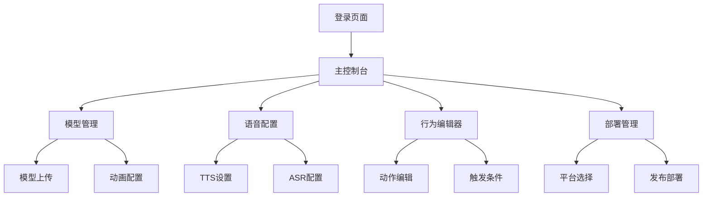

## 1. 产品概述
数字人项目是一个基于Web技术的3D虚拟人物交互系统，通过整合3D建模、语音交互、行为控制等技术，为用户提供逼真的虚拟人物交互体验。该系统支持多平台部署，可应用于客服、教育、娱乐等多个场景。

目标用户包括企业客户（客服、培训）、教育机构（在线教学）、以及个人开发者（娱乐应用）。产品价值在于降低虚拟人物开发门槛，提供一站式的数字人解决方案。

## 2. 核心功能

### 2.1 用户角色
| 角色 | 注册方式 | 核心权限 |
|------|----------|----------|
| 普通用户 | 邮箱注册 | 基础交互、查看数字人 |
| 开发者 | 邮箱+开发者认证 | 自定义数字人、API调用 |
| 管理员 | 后台分配 | 系统管理、用户管理 |

### 2.2 功能模块
数字人项目包含以下核心页面：
1. **主控制台**: 数字人预览、场景选择、参数调节
2. **模型管理**: 3D模型上传、编辑、动画配置
3. **语音配置**: TTS语音设置、ASR识别配置
4. **行为编辑器**: 动作序列编辑、触发条件设置
5. **部署管理**: 多平台打包、发布配置

### 2.3 页面详情
| 页面名称 | 模块名称 | 功能描述 |
|----------|----------|----------|
| 主控制台 | 数字人预览区 | 实时渲染3D数字人，支持360度旋转查看，调节光照和背景 |
| 主控制台 | 场景选择器 | 提供多种预设场景（办公室、教室、舞台等），支持自定义场景上传 |
| 主控制台 | 参数调节面板 | 调节数字人大小、位置、表情强度、动作速度等参数 |
| 模型管理 | 模型上传 | 支持FBX、GLTF格式3D模型上传，自动检测模型完整性和兼容性 |
| 模型管理 | 模型编辑器 | 可视化编辑模型节点，调整骨骼权重，设置默认姿势 |
| 模型管理 | 动画库 | 内置常用动画（走路、挥手、说话），支持自定义动画导入 |
| 语音配置 | TTS设置 | 选择语音合成引擎，调节语速、音调、音量，支持多种语言和声音 |
| 语音配置 | ASR配置 | 设置语音识别语言、敏感度，配置唤醒词和命令词 |
| 语音配置 | 音频预览 | 实时预览TTS效果，录制和测试ASR识别准确性 |
| 行为编辑器 | 动作序列 | 创建和编辑动作序列，设置动作间的过渡时间和触发条件 |
| 行为编辑器 | 触发条件 | 设置基于语音、时间、用户操作的触发条件 |
| 行为编辑器 | 行为测试 | 实时测试行为组合效果，调试动作执行时序 |
| 部署管理 | 平台选择 | 支持Web、移动端、小程序等多平台部署选项 |
| 部署管理 | 构建设置 | 配置构建参数，优化不同平台的性能和兼容性 |
| 部署管理 | 发布管理 | 版本控制、灰度发布、回滚机制 |

## 3. 核心流程

### 普通用户流程
用户登录系统后，可以在主控制台选择预设的数字人模型和场景，通过语音或文字与数字人进行交互。系统会实时响应用户输入，驱动数字人做出相应的动作和语音回复。

### 开发者流程
开发者可以上传自定义的3D模型，配置专属的语音参数，编辑复杂的行为逻辑，最终将自己的数字人应用部署到目标平台。

## 4. 用户界面设计

### 4.1 设计风格
- **主色调**: 深蓝色(#1a365d)为主，搭配白色和浅灰色
- **按钮样式**: 圆角矩形设计，主要操作为实心填充，次要操作为边框样式
- **字体**: 中文使用思源黑体，英文使用Inter，正文字号14px，标题字号18-24px
- **布局风格**: 左侧导航栏+右侧主工作区的卡片式布局
- **图标风格**: 使用线性图标，保持简洁现代的风格

### 4.2 页面设计概览
| 页面名称 | 模块名称 | UI元素 |
|----------|----------|--------|
| 主控制台 | 预览区 | 占据页面右侧70%空间，深色背景突出3D模型，底部悬浮控制条 |
| 主控制台 | 参数面板 | 左侧抽屉式设计，分组显示参数，滑块和数值输入框组合 |
| 模型管理 | 模型列表 | 网格布局展示模型缩略图，悬停显示操作按钮 |
| 语音配置 | 设置面板 | 标签页分组不同设置，实时波形图显示音频效果 |
| 行为编辑器 | 时间轴 | 底部时间轴设计，拖拽式编辑，支持缩放和关键帧设置 |

### 4.3 响应式设计
系统采用桌面端优先设计，支持1920x1080及以上分辨率。在平板设备上采用自适应布局，手机端提供简化版本的核心功能。所有交互元素都针对鼠标和触摸操作进行优化。