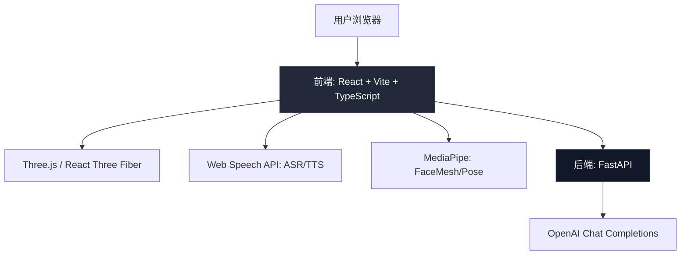

# MetaHuman Demo/SDK 技术架构（与当前实现一致）

## 1. 总体架构

说明：

- 前端负责：渲染、交互、语音（浏览器能力）、视觉推理（浏览器能力）。
- 后端负责：对话大脑（LLM 调用）与会话历史管理；无 key 或异常时回退 Mock。

## 2. 代码结构（实际目录）

- 前端：`src/`
  - `pages/`
    - `AdvancedDigitalHumanPage.tsx`
    - `DigitalHumanPage.tsx`
  - `components/`
    - `DigitalHumanViewer.tsx`
    - `ControlPanel.tsx`
    - `VoiceInteractionPanel.tsx`
    - `VisionMirrorPanel.tsx`
    - `ExpressionControlPanel.tsx`
    - `BehaviorControlPanel.tsx`
  - `core/`
    - `avatar/DigitalHumanEngine.ts`
    - `audio/audioService.ts`
    - `dialogue/dialogueService.ts`
    - `dialogue/dialogueOrchestrator.ts`
    - `vision/visionService.ts`
    - `vision/visionMapper.ts`
  - `store/digitalHumanStore.ts`

- 后端：`server/app/`
  - `main.py`（FastAPI 入口，挂载路由）
  - `api/chat.py`（`POST /v1/chat`）
  - `services/dialogue.py`（LLM 调用 + 会话历史 + Mock 回退）

## 3. 路由与页面

- `/`、`/advanced`：Advanced 页面（默认）
- `/digital-human`：基础页面

## 4. 接口契约

- `GET /health`
- `POST /v1/chat`
  - Request：`{ sessionId?, userText, meta? }`
  - Response：`{ replyText, emotion, action }`

## 5. 配置约束

- API Key 仅存在于后端环境变量：`OPENAI_API_KEY`（前端不应持有/透传）。
- `OPENAI_BASE_URL` 支持多种输入形式，后端会规范化为最终的 `/v1/chat/completions`。
