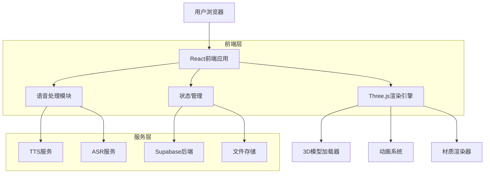
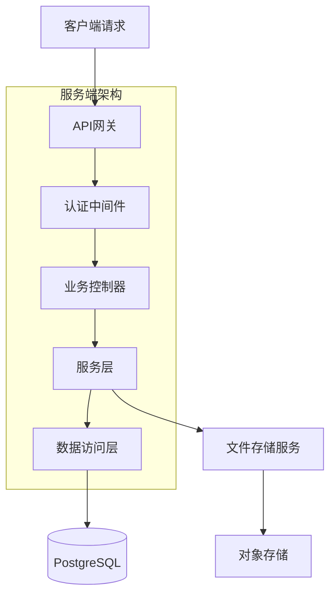
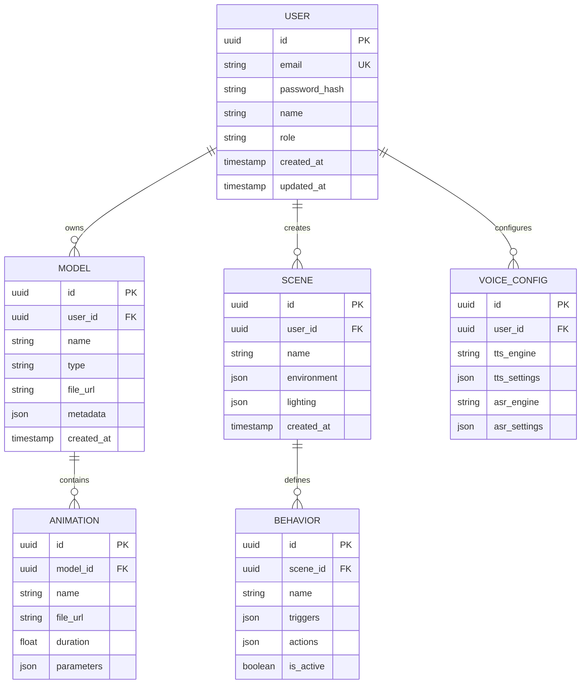

## 1. 架构设计



## 2. 技术描述

- **前端框架**: React@18 + TypeScript@5 + Vite@4
- **3D渲染**: Three.js@0.158 + React Three Fiber@8
- **状态管理**: Zustand@4 + Immer@10
- **UI组件**: Ant Design@5 + TailwindCSS@3
- **语音处理**: Web Speech API + Azure Speech SDK
- **后端服务**: Supabase@2 (PostgreSQL + Auth + Storage)
- **构建工具**: Vite@4 + Rollup
- **类型检查**: TypeScript@5 + ESLint@8

## 3. 路由定义

| 路由 | 用途 |
|------|------|
| / | 登录页面，用户认证入口 |
| /dashboard | 主控制台，数字人预览和基础控制 |
| /models | 模型管理页面，3D模型上传和编辑 |
| /voice | 语音配置页面，TTS和ASR设置 |
| /behavior | 行为编辑器，动作序列编辑 |
| /deploy | 部署管理页面，多平台发布 |
| /settings | 系统设置页面，用户配置 |

## 4. API定义

### 4.1 模型管理API

```
POST /api/models/upload
```

请求：
| 参数名 | 参数类型 | 是否必需 | 描述 |
|--------|----------|----------|------|
| file | File | 是 | 3D模型文件(FBX/GLTF) |
| name | string | 是 | 模型名称 |
| type | string | 是 | 模型类型(character/prop) |

响应：
| 参数名 | 参数类型 | 描述 |
|--------|----------|------|
| id | string | 模型唯一标识 |
| url | string | 模型文件访问地址 |
| status | string | 处理状态 |

### 4.2 语音合成API

```
POST /api/tts/synthesize
```

请求：
| 参数名 | 参数类型 | 是否必需 | 描述 |
|--------|----------|----------|------|
| text | string | 是 | 要合成的文本 |
| voice | string | 否 | 语音类型(默认zh-CN) |
| speed | number | 否 | 语速(0.5-2.0) |
| pitch | number | 否 | 音调(-20到20) |

响应：
| 参数名 | 参数类型 | 描述 |
|--------|----------|------|
| audio_url | string | 音频文件URL |
| duration | number | 音频时长(秒) |

### 4.3 语音识别API

```
POST /api/asr/recognize
```

请求：
| 参数名 | 参数类型 | 是否必需 | 描述 |
|--------|----------|----------|------|
| audio | File | 是 | 音频文件 |
| language | string | 否 | 识别语言(默认zh-CN) |

响应：
| 参数名 | 参数类型 | 描述 |
|--------|----------|------|
| text | string | 识别文本 |
| confidence | number | 识别置信度 |

## 5. 服务器架构设计



## 6. 数据模型

### 6.1 实体关系图



### 6.2 数据定义语言

用户表(users)
```sql
CREATE TABLE users (
    id UUID PRIMARY KEY DEFAULT gen_random_uuid(),
    email VARCHAR(255) UNIQUE NOT NULL,
    password_hash VARCHAR(255) NOT NULL,
    name VARCHAR(100) NOT NULL,
    role VARCHAR(20) DEFAULT 'user' CHECK (role IN ('user', 'developer', 'admin')),
    created_at TIMESTAMP WITH TIME ZONE DEFAULT NOW(),
    updated_at TIMESTAMP WITH TIME ZONE DEFAULT NOW()
);

-- 索引
CREATE INDEX idx_users_email ON users(email);
CREATE INDEX idx_users_role ON users(role);
```

模型表(models)
```sql
CREATE TABLE models (
    id UUID PRIMARY KEY DEFAULT gen_random_uuid(),
    user_id UUID REFERENCES users(id) ON DELETE CASCADE,
    name VARCHAR(255) NOT NULL,
    type VARCHAR(50) CHECK (type IN ('character', 'prop', 'environment')),
    file_url TEXT NOT NULL,
    file_size BIGINT,
    metadata JSONB DEFAULT '{}',
    is_public BOOLEAN DEFAULT false,
    created_at TIMESTAMP WITH TIME ZONE DEFAULT NOW(),
    updated_at TIMESTAMP WITH TIME ZONE DEFAULT NOW()
);

-- 索引
CREATE INDEX idx_models_user_id ON models(user_id);
CREATE INDEX idx_models_type ON models(type);
```

动画表(animations)
```sql
CREATE TABLE animations (
    id UUID PRIMARY KEY DEFAULT gen_random_uuid(),
    model_id UUID REFERENCES models(id) ON DELETE CASCADE,
    name VARCHAR(255) NOT NULL,
    file_url TEXT NOT NULL,
    duration FLOAT,
    parameters JSONB DEFAULT '{}',
    is_loop BOOLEAN DEFAULT false,
    created_at TIMESTAMP WITH TIME ZONE DEFAULT NOW()
);

-- 索引
CREATE INDEX idx_animations_model_id ON animations(model_id);
```

场景表(scenes)
```sql
CREATE TABLE scenes (
    id UUID PRIMARY KEY DEFAULT gen_random_uuid(),
    user_id UUID REFERENCES users(id) ON DELETE CASCADE,
    name VARCHAR(255) NOT NULL,
    environment JSONB DEFAULT '{}',
    lighting JSONB DEFAULT '{}',
    camera_settings JSONB DEFAULT '{}',
    is_active BOOLEAN DEFAULT true,
    created_at TIMESTAMP WITH TIME ZONE DEFAULT NOW(),
    updated_at TIMESTAMP WITH TIME ZONE DEFAULT NOW()
);

-- 索引
CREATE INDEX idx_scenes_user_id ON scenes(user_id);
```

行为配置表(behaviors)
```sql
CREATE TABLE behaviors (
    id UUID PRIMARY KEY DEFAULT gen_random_uuid(),
    scene_id UUID REFERENCES scenes(id) ON DELETE CASCADE,
    name VARCHAR(255) NOT NULL,
    triggers JSONB DEFAULT '[]',
    actions JSONB DEFAULT '[]',
    priority INTEGER DEFAULT 0,
    is_active BOOLEAN DEFAULT true,
    created_at TIMESTAMP WITH TIME ZONE DEFAULT NOW(),
    updated_at TIMESTAMP WITH TIME ZONE DEFAULT NOW()
);

-- 索引
CREATE INDEX idx_behaviors_scene_id ON behaviors(scene_id);
```

### 6.3 权限设置

```sql
-- 匿名用户权限（只读）
GRANT SELECT ON users TO anon;
GRANT SELECT ON models TO anon;
GRANT SELECT ON animations TO anon;
GRANT SELECT ON scenes TO anon;

-- 认证用户权限（读写）
GRANT ALL PRIVILEGES ON users TO authenticated;
GRANT ALL PRIVILEGES ON models TO authenticated;
GRANT ALL PRIVILEGES ON animations TO authenticated;
GRANT ALL PRIVILEGES ON scenes TO authenticated;
GRANT ALL PRIVILEGES ON behaviors TO authenticated;

-- RLS策略（行级安全）
ALTER TABLE models ENABLE ROW LEVEL SECURITY;
ALTER TABLE scenes ENABLE ROW LEVEL SECURITY;
ALTER TABLE behaviors ENABLE ROW LEVEL SECURITY;

-- 用户只能访问自己的数据
CREATE POLICY "用户只能访问自己的模型" ON models
    FOR ALL TO authenticated
    USING (auth.uid() = user_id);

CREATE POLICY "用户只能访问自己的场景" ON scenes
    FOR ALL TO authenticated
    USING (auth.uid() = user_id);

CREATE POLICY "用户只能访问自己的行为配置" ON behaviors
    FOR ALL TO authenticated
    USING (auth.uid() = scene_id);
```

## 7. 性能要求

### 7.1 前端性能
- 初始加载时间：< 3秒
- 3D模型加载时间：< 5秒（标准模型）
- 动画切换延迟：< 100ms
- 语音响应延迟：< 500ms
- 帧率：> 30fps（标准设备）

### 7.2 后端性能
- API响应时间：< 200ms
- 文件上传速度：> 1MB/s
- 并发用户支持：> 100个同时在线
- 数据库查询响应：< 100ms

### 7.3 资源占用
- 内存占用：< 500MB（单个页面）
- GPU使用率：< 70%（标准设备）
- 网络带宽：< 2MB/s（正常交互）

## 8. 部署架构

### 8.1 开发环境
- 本地开发服务器：Vite dev server
- 热更新：支持模块热替换
- 调试工具：React DevTools + Redux DevTools

### 8.2 生产环境
- 静态资源托管：CDN + 对象存储
- API服务：Supabase Edge Functions
- 数据库：Supabase PostgreSQL
- 文件存储：Supabase Storage

### 8.3 多平台部署
- Web端：响应式Web应用
- 移动端：React Native + WebView
- 小程序：微信小程序原生开发
- 桌面端：Electron打包

### 8.4 监控和日志
- 性能监控：Web Vitals + Custom Metrics
- 错误追踪：Sentry集成
- 用户行为：Google Analytics
- 日志收集：Winston + LogRocket